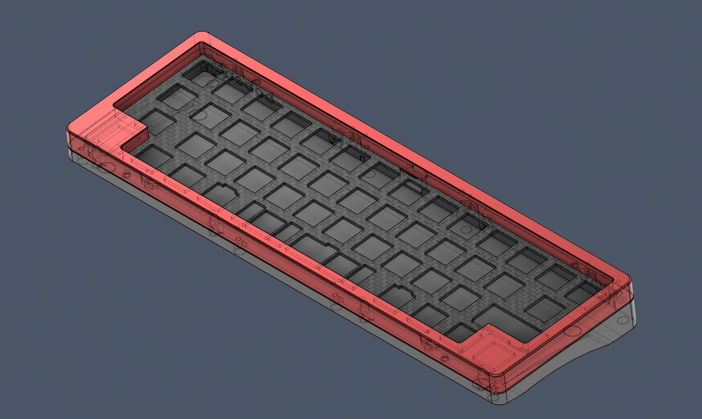
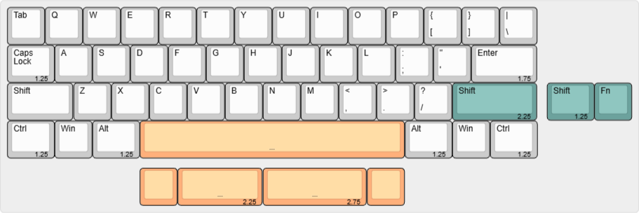
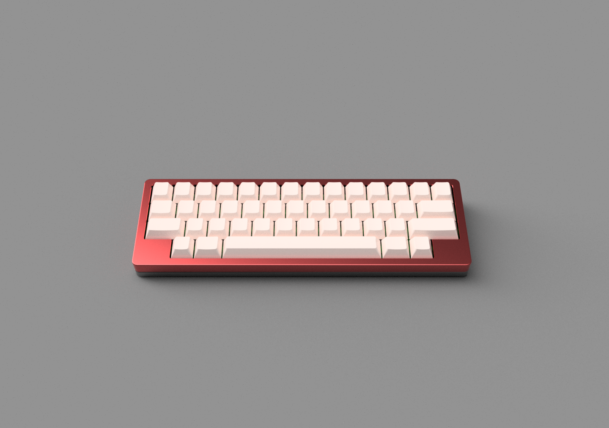
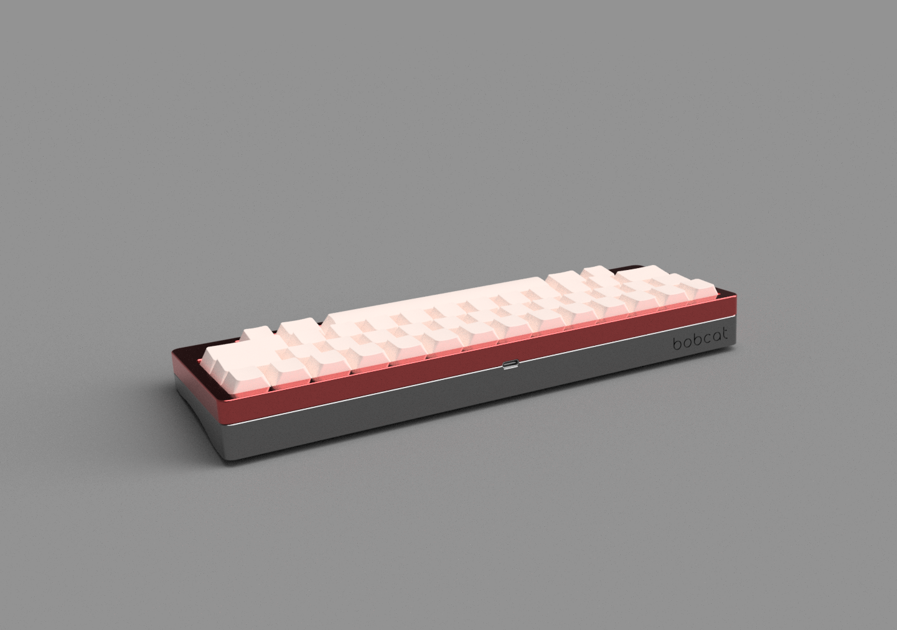
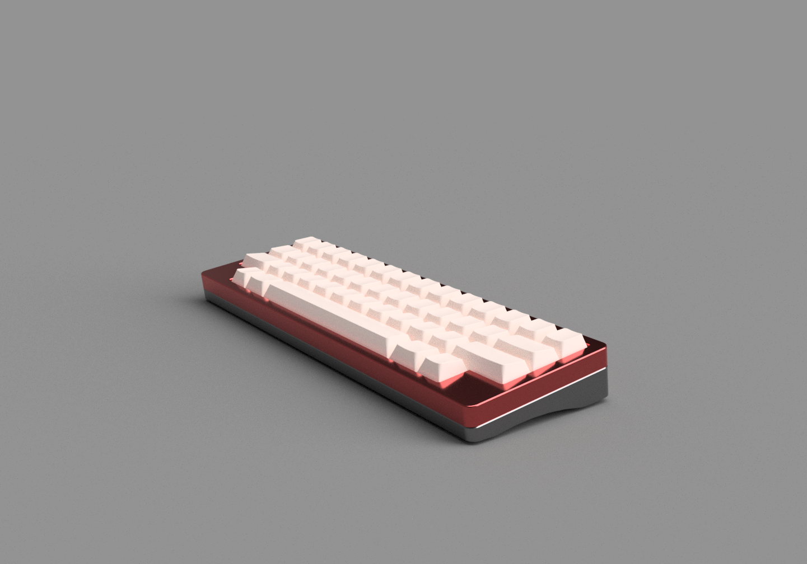

# Bobcat

Case, plate, and PCB outline files for **Bobcat**, a 50% keyboard with a dual mounting system for top mount and PCB-mounted tadpole mount. Bobcat is designed around a 1.6mm thickness PCB, and a top mounted USB port. Three top case options are available (WK, WKL, Corner blockers).

## Files
### Keyboard 
- [Top WK](https://github.com/14x71/Bobcat/blob/main/STEPs/Bobcat%20-%20Top_WK.step)
- [Top WKL](https://github.com/14x71/Bobcat/blob/main/STEPs/Bobcat%20-%20Top_WKL.step)
- [Top Corner blockers](https://github.com/14x71/Bobcat/blob/main/STEPs/Bobcat%20-%20Top_CornerBlockers.step)
- [Bottom](https://github.com/14x71/Bobcat/blob/main/STEPs/Bobcat%20-%20Bottom.step)
- [Plate](https://github.com/14x71/Bobcat/blob/main/DXF/Bobcat%20Plate)

### PCB 
- [PCB Outline
](https://github.com/14x71/Bobcat/blob/main/DXF/Bobcat%20-%20PCBOutline.dxf)

### Hardware
- Case screws: M2.5 x 10mm * 8
- Plate screws: M2 x 6mm * 6
- Rubber feet: Circular 8mm / 3m SJ5302

### Supported Layout

### Renders

### Licenses
The files in the repository are licensed under the Attribution-NonCommercial 4.0 International, refer to [LICENSE](https://github.com/14x71/Bobcat/blob/main/LICENSE.md) for further details.
